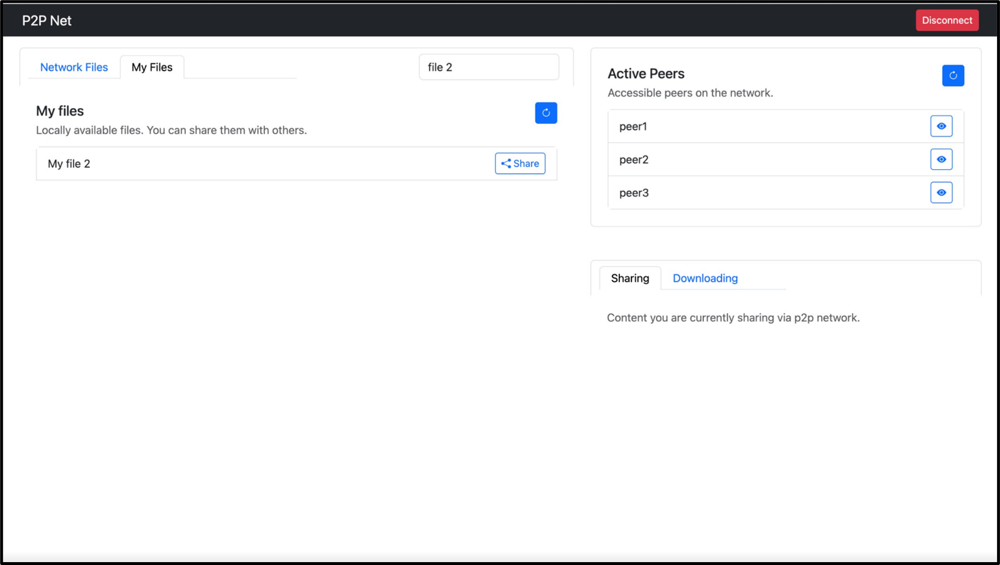

# P2P Network



A decentralized peer-to-peer network that allows users to share files with each other. The network is built on top of the Gnutella protocol and uses a custom file sharing algorithm to ensure that files are always available to download.


## Installation

```bash
git clone https://github.com/Gennadion/p2p-network.git
cd p2p-network
pip install -r requirements.txt
```

## Usage

```bash
python ./p2pUI/manage.py runserver
```

## Features

- Decentralized
- Automatic Peer Discovery
- File Indexing
- File Tracking
- File Segmentation
- Retention Algorithm
- Responsive UI